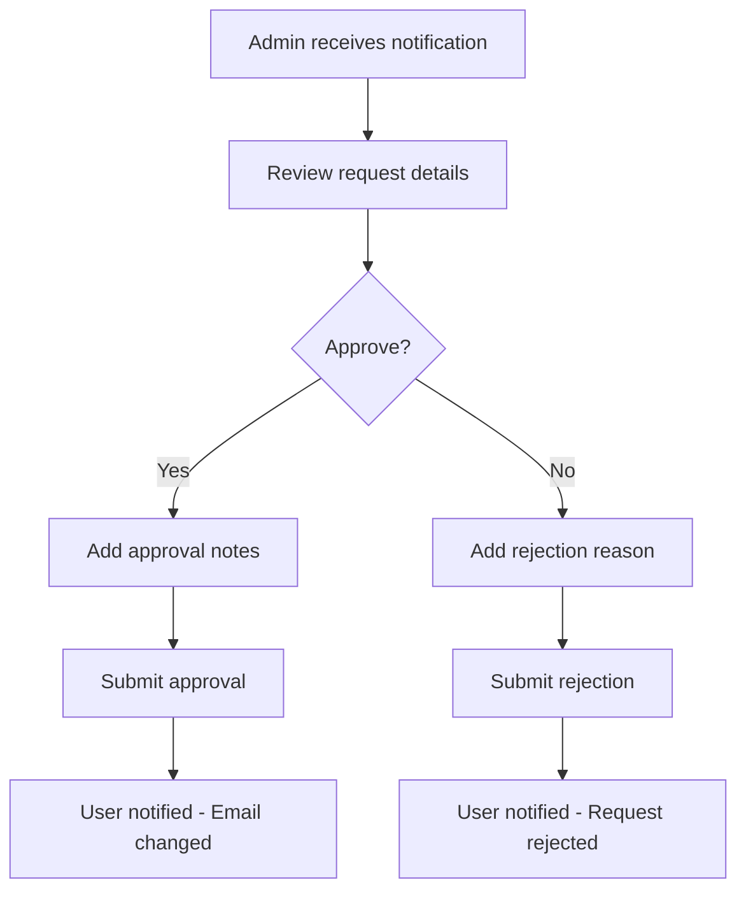

# Email Change Workflow - Frontend Integration Guide

## 🎯 Overview

This document provides comprehensive guidance for frontend developers to integrate the email change workflow feature into the Aerotage Time Reporting application. The email change workflow provides a secure, auditable process for users to change their email addresses with proper verification and admin approval workflows.

## 📋 Table of Contents

1. [Quick Start](#quick-start)
2. [API Endpoints](#api-endpoints)
3. [Authentication](#authentication)
4. [User Flow Diagrams](#user-flow-diagrams)
5. [Implementation Examples](#implementation-examples)
6. [Error Handling](#error-handling)
7. [UI/UX Recommendations](#uiux-recommendations)
8. [Testing](#testing)
9. [Security Considerations](#security-considerations)

## 🚀 Quick Start

### Base Configuration

```typescript
// API Configuration
const API_BASE_URL = 'https://time-api-dev.aerotage.com';

// Email Change API Endpoints
const EMAIL_CHANGE_ENDPOINTS = {
  submit: '/email-change',
  list: '/email-change',
  verify: '/email-change/verify',
  cancel: '/email-change/{id}',
  resend: '/email-change/{id}/resend',
  adminApprove: '/email-change/{id}/approve',
  adminReject: '/email-change/{id}/reject'
};
```

### Required Dependencies

```json
{
  "dependencies": {
    "axios": "^1.6.0",
    "@types/node": "^20.0.0"
  }
}
```

## 🔗 API Endpoints

### 1. Submit Email Change Request

**Endpoint:** `POST /email-change`  
**Authentication:** Required (Bearer Token)  
**User Roles:** All authenticated users

#### Request Format

```typescript
interface CreateEmailChangeRequest {
  newEmail: string;
  reason: 'name_change' | 'company_change' | 'personal_preference' | 'security_concern' | 'other';
  customReason?: string; // Required if reason is 'other'
  currentPassword: string; // For security verification
}
```

#### Example Request

```typescript
const submitEmailChange = async (requestData: CreateEmailChangeRequest) => {
  try {
    const response = await fetch(`${API_BASE_URL}/email-change`, {
      method: 'POST',
      headers: {
        'Content-Type': 'application/json',
        'Authorization': `Bearer ${accessToken}`
      },
      body: JSON.stringify(requestData)
    });

    const result = await response.json();
    
    if (result.success) {
      return result.data;
    } else {
      throw new Error(result.error.message);
    }
  } catch (error) {
    console.error('Email change submission failed:', error);
    throw error;
  }
};
```

#### Success Response

```typescript
{
  "success": true,
  "data": {
    "requestId": "req_abc123",
    "status": "pending_verification",
    "currentEmail": "user@company.com",
    "newEmail": "user@newcompany.com",
    "reason": "company_change",
    "requestedAt": "2024-01-15T10:30:00Z",
    "estimatedCompletionTime": "2024-01-17T10:30:00Z",
    "verificationRequired": {
      "currentEmail": true,
      "newEmail": true
    },
    "nextSteps": [
      "Check your current email (user@company.com) for verification link",
      "Check your new email (user@newcompany.com) for verification link",
      "Both emails must be verified before processing"
    ]
  },
  "message": "Email change request submitted successfully. Please check both email addresses for verification links."
}
```

### 2. List Email Change Requests

**Endpoint:** `GET /email-change`  
**Authentication:** Required (Bearer Token)  
**User Roles:** All authenticated users (own requests), Admin/Manager (all requests)

#### Query Parameters

```typescript
interface EmailChangeRequestFilters {
  status?: 'pending_verification' | 'pending_approval' | 'approved' | 'rejected' | 'completed' | 'cancelled';
  limit?: number; // Default: 10, Max: 50
  offset?: number; // Default: 0
  sortBy?: 'requestedAt' | 'status' | 'reason';
  sortOrder?: 'asc' | 'desc'; // Default: 'desc'
}
```

#### Example Request

```typescript
const getEmailChangeRequests = async (filters: EmailChangeRequestFilters = {}) => {
  const queryParams = new URLSearchParams();
  
  Object.entries(filters).forEach(([key, value]) => {
    if (value !== undefined) {
      queryParams.append(key, value.toString());
    }
  });

  const response = await fetch(`${API_BASE_URL}/email-change?${queryParams}`, {
    headers: {
      'Authorization': `Bearer ${accessToken}`
    }
  });

  return response.json();
};
```

#### Success Response

```typescript
{
  "success": true,
  "data": {
    "requests": [
      {
        "id": "req_abc123",
        "userId": "user_123",
        "currentEmail": "user@company.com",
        "newEmail": "user@newcompany.com",
        "status": "pending_verification",
        "reason": "company_change",
        "currentEmailVerified": false,
        "newEmailVerified": false,
        "requestedAt": "2024-01-15T10:30:00Z",
        "estimatedCompletionTime": "2024-01-17T10:30:00Z"
      }
    ],
    "pagination": {
      "total": 1,
      "limit": 10,
      "offset": 0,
      "hasMore": false
    }
  }
}
```

### 3. Email Verification

**Endpoint:** `POST /email-change/verify`  
**Authentication:** Required (Bearer Token)  
**User Roles:** All authenticated users

#### Request Format

```typescript
interface EmailVerificationRequest {
  token: string; // Verification token from email
  emailType: 'current' | 'new';
}
```

#### Example Request

```typescript
const verifyEmail = async (token: string, emailType: 'current' | 'new') => {
  const response = await fetch(`${API_BASE_URL}/email-change/verify`, {
    method: 'POST',
    headers: {
      'Content-Type': 'application/json',
      'Authorization': `Bearer ${accessToken}`
    },
    body: JSON.stringify({ token, emailType })
  });

  return response.json();
};
```

#### Success Response

```typescript
{
  "success": true,
  "data": {
    "requestId": "req_abc123",
    "emailType": "current",
    "verified": true,
    "verificationStatus": {
      "currentEmailVerified": true,
      "newEmailVerified": false
    },
    "nextStep": "verify_other_email",
    "message": "Current email verified successfully. Please verify your new email address."
  }
}
```

### 4. Cancel Email Change Request

**Endpoint:** `DELETE /email-change/{id}`  
**Authentication:** Required (Bearer Token)  
**User Roles:** Request owner, Admin

#### Example Request

```typescript
const cancelEmailChangeRequest = async (requestId: string) => {
  const response = await fetch(`${API_BASE_URL}/email-change/${requestId}`, {
    method: 'DELETE',
    headers: {
      'Authorization': `Bearer ${accessToken}`
    }
  });

  return response.json();
};
```

### 5. Resend Verification Email

**Endpoint:** `POST /email-change/{id}/resend`  
**Authentication:** Required (Bearer Token)  
**User Roles:** Request owner

#### Request Format

```typescript
interface ResendVerificationRequest {
  emailType: 'current' | 'new';
}
```

#### Example Request

```typescript
const resendVerificationEmail = async (requestId: string, emailType: 'current' | 'new') => {
  const response = await fetch(`${API_BASE_URL}/email-change/${requestId}/resend`, {
    method: 'POST',
    headers: {
      'Content-Type': 'application/json',
      'Authorization': `Bearer ${accessToken}`
    },
    body: JSON.stringify({ emailType })
  });

  return response.json();
};
```

### 6. Admin Approve Request

**Endpoint:** `POST /email-change/{id}/approve`  
**Authentication:** Required (Bearer Token)  
**User Roles:** Admin, Manager

#### Request Format

```typescript
interface ApproveEmailChangeRequest {
  approvalNotes?: string;
}
```

### 7. Admin Reject Request

**Endpoint:** `POST /email-change/{id}/reject`  
**Authentication:** Required (Bearer Token)  
**User Roles:** Admin, Manager

#### Request Format

```typescript
interface RejectEmailChangeRequest {
  rejectionReason: string;
}
```

## 🔐 Authentication

All API endpoints require authentication using JWT Bearer tokens obtained from AWS Cognito.

### Token Usage

```typescript
// Include in all API requests
const headers = {
  'Authorization': `Bearer ${accessToken}`,
  'Content-Type': 'application/json'
};
```

### Token Refresh

```typescript
// Handle token expiration
const makeAuthenticatedRequest = async (url: string, options: RequestInit) => {
  try {
    const response = await fetch(url, {
      ...options,
      headers: {
        ...options.headers,
        'Authorization': `Bearer ${accessToken}`
      }
    });

    if (response.status === 401) {
      // Token expired, refresh and retry
      await refreshToken();
      return makeAuthenticatedRequest(url, options);
    }

    return response;
  } catch (error) {
    console.error('API request failed:', error);
    throw error;
  }
};
```

## 📊 User Flow Diagrams

### Standard User Flow

```mermaid
graph TD
    A[User clicks "Change Email"] --> B[Fill out form]
    B --> C[Submit request]
    C --> D[Check current email]
    D --> E[Click verification link]
    E --> F[Check new email]
    F --> G[Click verification link]
    G --> H{Auto-approval?}
    H -->|Yes| I[Email changed]
    H -->|No| J[Wait for admin approval]
    J --> K[Admin reviews]
    K --> L{Approved?}
    L -->|Yes| I
    L -->|No| M[Request rejected]
```

### Admin Approval Flow



## 💻 Implementation Examples

### React Component Example

```typescript
import React, { useState, useEffect } from 'react';
import { EmailChangeService } from '../services/emailChangeService';

interface EmailChangeFormProps {
  currentEmail: string;
  onSuccess: () => void;
  onError: (error: string) => void;
}

const EmailChangeForm: React.FC<EmailChangeFormProps> = ({
  currentEmail,
  onSuccess,
  onError
}) => {
  const [formData, setFormData] = useState({
    newEmail: '',
    reason: 'personal_preference' as const,
    customReason: '',
    currentPassword: ''
  });
  const [isSubmitting, setIsSubmitting] = useState(false);
  const [errors, setErrors] = useState<Record<string, string>>({});

  const validateForm = () => {
    const newErrors: Record<string, string> = {};

    if (!formData.newEmail) {
      newErrors.newEmail = 'New email is required';
    } else if (!/^[^\s@]+@[^\s@]+\.[^\s@]+$/.test(formData.newEmail)) {
      newErrors.newEmail = 'Please enter a valid email address';
    } else if (formData.newEmail === currentEmail) {
      newErrors.newEmail = 'New email must be different from current email';
    }

    if (!formData.currentPassword) {
      newErrors.currentPassword = 'Current password is required for verification';
    }

    if (formData.reason === 'other' && !formData.customReason) {
      newErrors.customReason = 'Please specify the reason for email change';
    }

    setErrors(newErrors);
    return Object.keys(newErrors).length === 0;
  };

  const handleSubmit = async (e: React.FormEvent) => {
    e.preventDefault();
    
    if (!validateForm()) {
      return;
    }

    setIsSubmitting(true);
    
    try {
      const result = await EmailChangeService.submitRequest(formData);
      onSuccess();
      
      // Show success message with next steps
      alert(`Email change request submitted successfully!\n\nNext steps:\n${result.nextSteps.join('\n')}`);
    } catch (error) {
      onError(error instanceof Error ? error.message : 'Failed to submit email change request');
    } finally {
      setIsSubmitting(false);
    }
  };

  return (
    <form onSubmit={handleSubmit} className="email-change-form">
      <div className="form-group">
        <label htmlFor="currentEmail">Current Email</label>
        <input
          type="email"
          id="currentEmail"
          value={currentEmail}
          disabled
          className="form-control"
        />
      </div>

      <div className="form-group">
        <label htmlFor="newEmail">New Email Address *</label>
        <input
          type="email"
          id="newEmail"
          value={formData.newEmail}
          onChange={(e) => setFormData({ ...formData, newEmail: e.target.value })}
          className={`form-control ${errors.newEmail ? 'error' : ''}`}
          required
        />
        {errors.newEmail && <span className="error-message">{errors.newEmail}</span>}
      </div>

      <div className="form-group">
        <label htmlFor="reason">Reason for Change *</label>
        <select
          id="reason"
          value={formData.reason}
          onChange={(e) => setFormData({ ...formData, reason: e.target.value as any })}
          className="form-control"
          required
        >
          <option value="personal_preference">Personal Preference</option>
          <option value="name_change">Name Change</option>
          <option value="company_change">Company Change</option>
          <option value="security_concern">Security Concern</option>
          <option value="other">Other</option>
        </select>
      </div>

      {formData.reason === 'other' && (
        <div className="form-group">
          <label htmlFor="customReason">Please specify *</label>
          <textarea
            id="customReason"
            value={formData.customReason}
            onChange={(e) => setFormData({ ...formData, customReason: e.target.value })}
            className={`form-control ${errors.customReason ? 'error' : ''}`}
            rows={3}
            placeholder="Please provide details about why you need to change your email..."
          />
          {errors.customReason && <span className="error-message">{errors.customReason}</span>}
        </div>
      )}

      <div className="form-group">
        <label htmlFor="currentPassword">Current Password *</label>
        <input
          type="password"
          id="currentPassword"
          value={formData.currentPassword}
          onChange={(e) => setFormData({ ...formData, currentPassword: e.target.value })}
          className={`form-control ${errors.currentPassword ? 'error' : ''}`}
          required
        />
        {errors.currentPassword && <span className="error-message">{errors.currentPassword}</span>}
        <small className="help-text">Required for security verification</small>
      </div>

      <div className="form-actions">
        <button
          type="submit"
          disabled={isSubmitting}
          className="btn btn-primary"
        >
          {isSubmitting ? 'Submitting...' : 'Submit Email Change Request'}
        </button>
      </div>

      <div className="info-box">
        <h4>What happens next?</h4>
        <ul>
          <li>You'll receive verification emails at both your current and new email addresses</li>
          <li>Both emails must be verified before processing can continue</li>
          <li>Some changes may require admin approval</li>
          <li>You'll be notified of any status updates</li>
        </ul>
      </div>
    </form>
  );
};

export default EmailChangeForm;
```

### Service Layer Example

```typescript
// services/emailChangeService.ts
class EmailChangeService {
  private static baseUrl = process.env.REACT_APP_API_BASE_URL || 'https://time-api-dev.aerotage.com';

  static async submitRequest(data: CreateEmailChangeRequest) {
    const response = await fetch(`${this.baseUrl}/email-change`, {
      method: 'POST',
      headers: {
        'Content-Type': 'application/json',
        'Authorization': `Bearer ${this.getAccessToken()}`
      },
      body: JSON.stringify(data)
    });

    const result = await response.json();
    
    if (!result.success) {
      throw new Error(result.error.message);
    }

    return result.data;
  }

  static async getRequests(filters: EmailChangeRequestFilters = {}) {
    const queryParams = new URLSearchParams();
    Object.entries(filters).forEach(([key, value]) => {
      if (value !== undefined) {
        queryParams.append(key, value.toString());
      }
    });

    const response = await fetch(`${this.baseUrl}/email-change?${queryParams}`, {
      headers: {
        'Authorization': `Bearer ${this.getAccessToken()}`
      }
    });

    const result = await response.json();
    
    if (!result.success) {
      throw new Error(result.error.message);
    }

    return result.data;
  }

  static async verifyEmail(token: string, emailType: 'current' | 'new') {
    const response = await fetch(`${this.baseUrl}/email-change/verify`, {
      method: 'POST',
      headers: {
        'Content-Type': 'application/json',
        'Authorization': `Bearer ${this.getAccessToken()}`
      },
      body: JSON.stringify({ token, emailType })
    });

    const result = await response.json();
    
    if (!result.success) {
      throw new Error(result.error.message);
    }

    return result.data;
  }

  static async cancelRequest(requestId: string) {
    const response = await fetch(`${this.baseUrl}/email-change/${requestId}`, {
      method: 'DELETE',
      headers: {
        'Authorization': `Bearer ${this.getAccessToken()}`
      }
    });

    const result = await response.json();
    
    if (!result.success) {
      throw new Error(result.error.message);
    }

    return result.data;
  }

  static async resendVerification(requestId: string, emailType: 'current' | 'new') {
    const response = await fetch(`${this.baseUrl}/email-change/${requestId}/resend`, {
      method: 'POST',
      headers: {
        'Content-Type': 'application/json',
        'Authorization': `Bearer ${this.getAccessToken()}`
      },
      body: JSON.stringify({ emailType })
    });

    const result = await response.json();
    
    if (!result.success) {
      throw new Error(result.error.message);
    }

    return result.data;
  }

  // Admin functions
  static async approveRequest(requestId: string, approvalNotes?: string) {
    const response = await fetch(`${this.baseUrl}/email-change/${requestId}/approve`, {
      method: 'POST',
      headers: {
        'Content-Type': 'application/json',
        'Authorization': `Bearer ${this.getAccessToken()}`
      },
      body: JSON.stringify({ approvalNotes })
    });

    const result = await response.json();
    
    if (!result.success) {
      throw new Error(result.error.message);
    }

    return result.data;
  }

  static async rejectRequest(requestId: string, rejectionReason: string) {
    const response = await fetch(`${this.baseUrl}/email-change/${requestId}/reject`, {
      method: 'POST',
      headers: {
        'Content-Type': 'application/json',
        'Authorization': `Bearer ${this.getAccessToken()}`
      },
      body: JSON.stringify({ rejectionReason })
    });

    const result = await response.json();
    
    if (!result.success) {
      throw new Error(result.error.message);
    }

    return result.data;
  }

  private static getAccessToken(): string {
    // Implement your token retrieval logic
    return localStorage.getItem('accessToken') || '';
  }
}

export default EmailChangeService;
```

### Email Verification Handler

```typescript
// components/EmailVerificationHandler.tsx
import React, { useEffect, useState } from 'react';
import { useSearchParams, useNavigate } from 'react-router-dom';
import { EmailChangeService } from '../services/emailChangeService';

const EmailVerificationHandler: React.FC = () => {
  const [searchParams] = useSearchParams();
  const navigate = useNavigate();
  const [status, setStatus] = useState<'verifying' | 'success' | 'error'>('verifying');
  const [message, setMessage] = useState('');
  const [verificationData, setVerificationData] = useState<any>(null);

  useEffect(() => {
    const token = searchParams.get('token');
    const emailType = searchParams.get('type') as 'current' | 'new';

    if (!token || !emailType) {
      setStatus('error');
      setMessage('Invalid verification link. Please check your email and try again.');
      return;
    }

    verifyEmail(token, emailType);
  }, [searchParams]);

  const verifyEmail = async (token: string, emailType: 'current' | 'new') => {
    try {
      const result = await EmailChangeService.verifyEmail(token, emailType);
      setStatus('success');
      setVerificationData(result);
      setMessage(result.message);
    } catch (error) {
      setStatus('error');
      setMessage(error instanceof Error ? error.message : 'Verification failed');
    }
  };

  const getNextStepMessage = () => {
    if (!verificationData) return '';

    switch (verificationData.nextStep) {
      case 'verify_other_email':
        return 'Please check your other email address and click the verification link there.';
      case 'pending_approval':
        return 'Both emails have been verified. Your request is now pending admin approval.';
      case 'auto_approved':
        return 'Your email change has been automatically approved and is being processed.';
      case 'processing':
        return 'Your email change is being processed. You will receive a confirmation email shortly.';
      default:
        return '';
    }
  };

  return (
    <div className="email-verification-page">
      <div className="verification-container">
        {status === 'verifying' && (
          <div className="verification-loading">
            <div className="spinner"></div>
            <h2>Verifying your email...</h2>
            <p>Please wait while we verify your email address.</p>
          </div>
        )}

        {status === 'success' && (
          <div className="verification-success">
            <div className="success-icon">✅</div>
            <h2>Email Verified Successfully!</h2>
            <p>{message}</p>
            
            {verificationData && (
              <div className="verification-status">
                <h3>Verification Status:</h3>
                <ul>
                  <li>
                    Current Email: {verificationData.verificationStatus.currentEmailVerified ? '✅ Verified' : '⏳ Pending'}
                  </li>
                  <li>
                    New Email: {verificationData.verificationStatus.newEmailVerified ? '✅ Verified' : '⏳ Pending'}
                  </li>
                </ul>
              </div>
            )}

            <div className="next-steps">
              <h3>Next Steps:</h3>
              <p>{getNextStepMessage()}</p>
            </div>

            <button
              onClick={() => navigate('/profile/email-change')}
              className="btn btn-primary"
            >
              View Email Change Status
            </button>
          </div>
        )}

        {status === 'error' && (
          <div className="verification-error">
            <div className="error-icon">❌</div>
            <h2>Verification Failed</h2>
            <p>{message}</p>
            
            <div className="error-actions">
              <button
                onClick={() => navigate('/profile/email-change')}
                className="btn btn-secondary"
              >
                Go to Email Change Settings
              </button>
              <button
                onClick={() => window.location.reload()}
                className="btn btn-outline"
              >
                Try Again
              </button>
            </div>
          </div>
        )}
      </div>
    </div>
  );
};

export default EmailVerificationHandler;
```

## ❌ Error Handling

### Error Response Format

All API endpoints return errors in a consistent format:

```typescript
{
  "success": false,
  "error": {
    "code": "ERROR_CODE",
    "message": "Human readable error message",
    "details": {
      // Additional error context
    }
  },
  "timestamp": "2024-01-15T10:30:00Z"
}
```

### Common Error Codes

```typescript
enum EmailChangeErrorCodes {
  // Request errors
  EMAIL_CHANGE_REQUEST_NOT_FOUND = 'EMAIL_CHANGE_REQUEST_NOT_FOUND',
  ACTIVE_REQUEST_EXISTS = 'ACTIVE_REQUEST_EXISTS',
  COOLDOWN_ACTIVE = 'COOLDOWN_ACTIVE',
  INVALID_NEW_EMAIL = 'INVALID_NEW_EMAIL',
  EMAIL_ALREADY_EXISTS = 'EMAIL_ALREADY_EXISTS',
  SAME_AS_CURRENT_EMAIL = 'SAME_AS_CURRENT_EMAIL',
  
  // Verification errors
  INVALID_VERIFICATION_TOKEN = 'INVALID_VERIFICATION_TOKEN',
  VERIFICATION_TOKEN_EXPIRED = 'VERIFICATION_TOKEN_EXPIRED',
  EMAIL_ALREADY_VERIFIED = 'EMAIL_ALREADY_VERIFIED',
  VERIFICATION_RATE_LIMITED = 'VERIFICATION_RATE_LIMITED',
  
  // Approval errors
  INSUFFICIENT_APPROVAL_PERMISSIONS = 'INSUFFICIENT_APPROVAL_PERMISSIONS',
  REQUEST_NOT_PENDING_APPROVAL = 'REQUEST_NOT_PENDING_APPROVAL',
  CANNOT_APPROVE_OWN_REQUEST = 'CANNOT_APPROVE_OWN_REQUEST',
  
  // System errors
  EMAIL_SEND_FAILED = 'EMAIL_SEND_FAILED',
  EMAIL_CHANGE_FAILED = 'EMAIL_CHANGE_FAILED'
}
```

### Error Handling Implementation

```typescript
const handleEmailChangeError = (error: any) => {
  const errorCode = error.error?.code;
  
  switch (errorCode) {
    case 'ACTIVE_REQUEST_EXISTS':
      return 'You already have an active email change request. Please complete or cancel it before submitting a new one.';
    
    case 'COOLDOWN_ACTIVE':
      return 'Please wait before submitting another email change request. You can submit a new request in a few hours.';
    
    case 'EMAIL_ALREADY_EXISTS':
      return 'This email address is already in use by another account. Please choose a different email address.';
    
    case 'SAME_AS_CURRENT_EMAIL':
      return 'The new email address must be different from your current email address.';
    
    case 'INVALID_VERIFICATION_TOKEN':
      return 'The verification link is invalid or has already been used. Please request a new verification email.';
    
    case 'VERIFICATION_TOKEN_EXPIRED':
      return 'The verification link has expired. Please request a new verification email.';
    
    case 'EMAIL_ALREADY_VERIFIED':
      return 'This email address has already been verified.';
    
    case 'INSUFFICIENT_APPROVAL_PERMISSIONS':
      return 'You do not have permission to approve email change requests.';
    
    case 'EMAIL_SEND_FAILED':
      return 'Failed to send verification email. Please try again or contact support.';
    
    default:
      return error.error?.message || 'An unexpected error occurred. Please try again.';
  }
};
```

## 🎨 UI/UX Recommendations

### Status Indicators

```typescript
const getStatusBadge = (status: string) => {
  const statusConfig = {
    'pending_verification': { color: 'orange', text: 'Pending Verification', icon: '⏳' },
    'pending_approval': { color: 'blue', text: 'Pending Approval', icon: '👥' },
    'approved': { color: 'green', text: 'Approved', icon: '✅' },
    'rejected': { color: 'red', text: 'Rejected', icon: '❌' },
    'completed': { color: 'green', text: 'Completed', icon: '🎉' },
    'cancelled': { color: 'gray', text: 'Cancelled', icon: '🚫' }
  };

  const config = statusConfig[status] || { color: 'gray', text: status, icon: '❓' };
  
  return (
    <span className={`status-badge status-${config.color}`}>
      <span className="status-icon">{config.icon}</span>
      {config.text}
    </span>
  );
};
```

### Progress Indicator

```typescript
const EmailChangeProgress: React.FC<{ request: EmailChangeRequest }> = ({ request }) => {
  const getProgressSteps = () => {
    const steps = [
      { key: 'submitted', label: 'Request Submitted', completed: true },
      { key: 'current_verified', label: 'Current Email Verified', completed: request.currentEmailVerified },
      { key: 'new_verified', label: 'New Email Verified', completed: request.newEmailVerified },
    ];

    // Add approval step if needed
    if (['pending_approval', 'approved', 'rejected', 'completed'].includes(request.status)) {
      steps.push({
        key: 'approved',
        label: 'Admin Approval',
        completed: ['approved', 'completed'].includes(request.status)
      });
    }

    steps.push({
      key: 'completed',
      label: 'Email Changed',
      completed: request.status === 'completed'
    });

    return steps;
  };

  return (
    <div className="progress-indicator">
      {getProgressSteps().map((step, index) => (
        <div key={step.key} className={`progress-step ${step.completed ? 'completed' : 'pending'}`}>
          <div className="step-indicator">
            {step.completed ? '✅' : index + 1}
          </div>
          <span className="step-label">{step.label}</span>
        </div>
      ))}
    </div>
  );
};
```

### Notification Components

```typescript
const EmailChangeNotification: React.FC<{ request: EmailChangeRequest }> = ({ request }) => {
  const getNotificationContent = () => {
    switch (request.status) {
      case 'pending_verification':
        return {
          type: 'info',
          title: 'Email Verification Required',
          message: 'Please check both your current and new email addresses for verification links.',
          actions: [
            { label: 'Resend Current Email', action: () => resendVerification(request.id, 'current') },
            { label: 'Resend New Email', action: () => resendVerification(request.id, 'new') }
          ]
        };
      
      case 'pending_approval':
        return {
          type: 'warning',
          title: 'Waiting for Admin Approval',
          message: 'Your email change request has been verified and is now waiting for admin approval.',
          actions: []
        };
      
      case 'approved':
        return {
          type: 'success',
          title: 'Request Approved',
          message: 'Your email change request has been approved and is being processed.',
          actions: []
        };
      
      case 'rejected':
        return {
          type: 'error',
          title: 'Request Rejected',
          message: `Your email change request was rejected. Reason: ${request.rejectionReason}`,
          actions: [
            { label: 'Submit New Request', action: () => window.location.href = '/profile/email-change/new' }
          ]
        };
      
      default:
        return null;
    }
  };

  const content = getNotificationContent();
  if (!content) return null;

  return (
    <div className={`notification notification-${content.type}`}>
      <h4>{content.title}</h4>
      <p>{content.message}</p>
      {content.actions.length > 0 && (
        <div className="notification-actions">
          {content.actions.map((action, index) => (
            <button key={index} onClick={action.action} className="btn btn-sm">
              {action.label}
            </button>
          ))}
        </div>
      )}
    </div>
  );
};
```

## 🧪 Testing

### Unit Test Example

```typescript
// __tests__/EmailChangeService.test.ts
import { EmailChangeService } from '../services/emailChangeService';

// Mock fetch
global.fetch = jest.fn();

describe('EmailChangeService', () => {
  beforeEach(() => {
    (fetch as jest.Mock).mockClear();
  });

  test('submitRequest should submit email change request successfully', async () => {
    const mockResponse = {
      success: true,
      data: {
        requestId: 'req_123',
        status: 'pending_verification',
        nextSteps: ['Check emails']
      }
    };

    (fetch as jest.Mock).mockResolvedValueOnce({
      json: () => Promise.resolve(mockResponse)
    });

    const requestData = {
      newEmail: 'new@example.com',
      reason: 'personal_preference' as const,
      currentPassword: 'password123'
    };

    const result = await EmailChangeService.submitRequest(requestData);

    expect(fetch).toHaveBeenCalledWith(
      expect.stringContaining('/email-change'),
      expect.objectContaining({
        method: 'POST',
        headers: expect.objectContaining({
          'Content-Type': 'application/json'
        }),
        body: JSON.stringify(requestData)
      })
    );

    expect(result).toEqual(mockResponse.data);
  });

  test('submitRequest should throw error on API failure', async () => {
    const mockErrorResponse = {
      success: false,
      error: {
        code: 'EMAIL_ALREADY_EXISTS',
        message: 'Email already exists'
      }
    };

    (fetch as jest.Mock).mockResolvedValueOnce({
      json: () => Promise.resolve(mockErrorResponse)
    });

    const requestData = {
      newEmail: 'existing@example.com',
      reason: 'personal_preference' as const,
      currentPassword: 'password123'
    };

    await expect(EmailChangeService.submitRequest(requestData))
      .rejects.toThrow('Email already exists');
  });
});
```

### Integration Test Example

```typescript
// __tests__/EmailChangeFlow.integration.test.tsx
import { render, screen, fireEvent, waitFor } from '@testing-library/react';
import { EmailChangeForm } from '../components/EmailChangeForm';

describe('Email Change Flow Integration', () => {
  test('complete email change submission flow', async () => {
    const mockOnSuccess = jest.fn();
    const mockOnError = jest.fn();

    render(
      <EmailChangeForm
        currentEmail="current@example.com"
        onSuccess={mockOnSuccess}
        onError={mockOnError}
      />
    );

    // Fill out form
    fireEvent.change(screen.getByLabelText(/new email/i), {
      target: { value: 'new@example.com' }
    });

    fireEvent.change(screen.getByLabelText(/current password/i), {
      target: { value: 'password123' }
    });

    fireEvent.change(screen.getByLabelText(/reason/i), {
      target: { value: 'personal_preference' }
    });

    // Submit form
    fireEvent.click(screen.getByText(/submit email change request/i));

    // Wait for submission
    await waitFor(() => {
      expect(mockOnSuccess).toHaveBeenCalled();
    });
  });
});
```

## 🔒 Security Considerations

### Input Validation

```typescript
const validateEmailChangeRequest = (data: CreateEmailChangeRequest) => {
  const errors: string[] = [];

  // Email validation
  if (!data.newEmail || !/^[^\s@]+@[^\s@]+\.[^\s@]+$/.test(data.newEmail)) {
    errors.push('Valid new email address is required');
  }

  // Password validation
  if (!data.currentPassword || data.currentPassword.length < 8) {
    errors.push('Current password is required for verification');
  }

  // Reason validation
  const validReasons = ['name_change', 'company_change', 'personal_preference', 'security_concern', 'other'];
  if (!validReasons.includes(data.reason)) {
    errors.push('Valid reason is required');
  }

  if (data.reason === 'other' && !data.customReason?.trim()) {
    errors.push('Custom reason is required when "other" is selected');
  }

  return errors;
};
```

### Token Security

```typescript
// Secure token handling
const handleVerificationToken = (token: string) => {
  // Validate token format
  if (!token || token.length !== 64 || !/^[a-f0-9]+$/.test(token)) {
    throw new Error('Invalid verification token format');
  }

  // Use token immediately and don't store
  return EmailChangeService.verifyEmail(token, emailType);
};
```

### Rate Limiting

```typescript
// Client-side rate limiting helper
class RateLimiter {
  private static attempts: Map<string, number[]> = new Map();

  static canMakeRequest(key: string, maxAttempts: number = 3, windowMs: number = 300000): boolean {
    const now = Date.now();
    const attempts = this.attempts.get(key) || [];
    
    // Remove old attempts outside the window
    const recentAttempts = attempts.filter(time => now - time < windowMs);
    
    if (recentAttempts.length >= maxAttempts) {
      return false;
    }

    // Record this attempt
    recentAttempts.push(now);
    this.attempts.set(key, recentAttempts);
    
    return true;
  }
}

// Usage
const handleResendVerification = async (requestId: string, emailType: 'current' | 'new') => {
  const rateLimitKey = `resend_${requestId}_${emailType}`;
  
  if (!RateLimiter.canMakeRequest(rateLimitKey, 3, 300000)) {
    throw new Error('Too many resend attempts. Please wait 5 minutes before trying again.');
  }

  return EmailChangeService.resendVerification(requestId, emailType);
};
```

## 📞 Support and Troubleshooting

### Common Issues

1. **Verification emails not received**
   - Check spam/junk folders
   - Verify email addresses are correct
   - Use resend functionality
   - Contact support if emails still not received

2. **Verification links not working**
   - Ensure links are clicked from the correct email address
   - Check if links have expired (24-hour expiry)
   - Request new verification emails if needed

3. **Admin approval delays**
   - Check with system administrators
   - Verify request is in "pending_approval" status
   - Ensure all verifications are complete

### Debug Information

```typescript
const getDebugInfo = (request: EmailChangeRequest) => {
  return {
    requestId: request.id,
    status: request.status,
    verificationStatus: {
      current: request.currentEmailVerified,
      new: request.newEmailVerified
    },
    timestamps: {
      requested: request.requestedAt,
      verified: request.verifiedAt,
      approved: request.approvedAt,
      completed: request.completedAt
    },
    reason: request.reason,
    customReason: request.customReason
  };
};
```

---

## 📝 Changelog

### Version 1.0.0 (2024-01-15)
- Initial implementation of email change workflow
- Complete API integration
- User verification flow
- Admin approval system
- Comprehensive error handling
- Security measures and rate limiting

---

For additional support or questions, please contact the backend development team or refer to the main API documentation. 